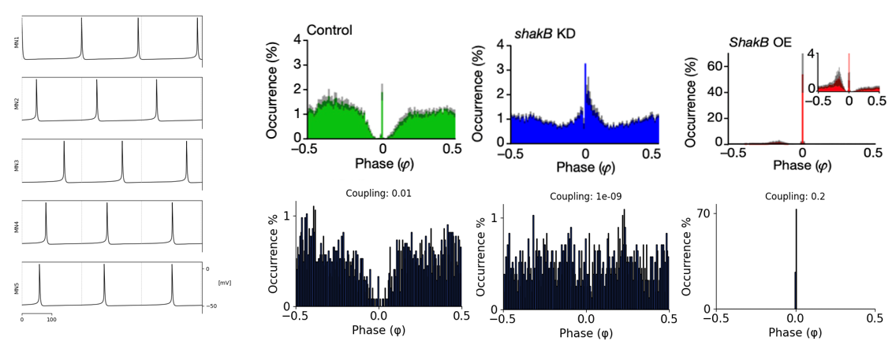
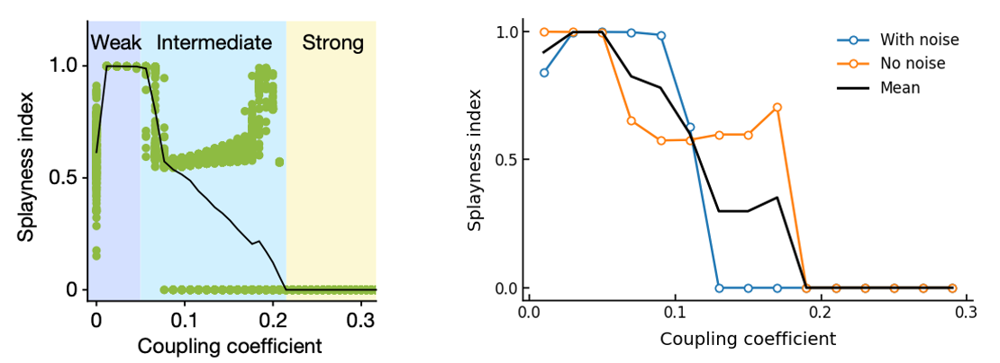
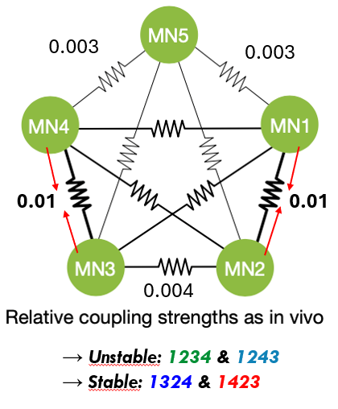
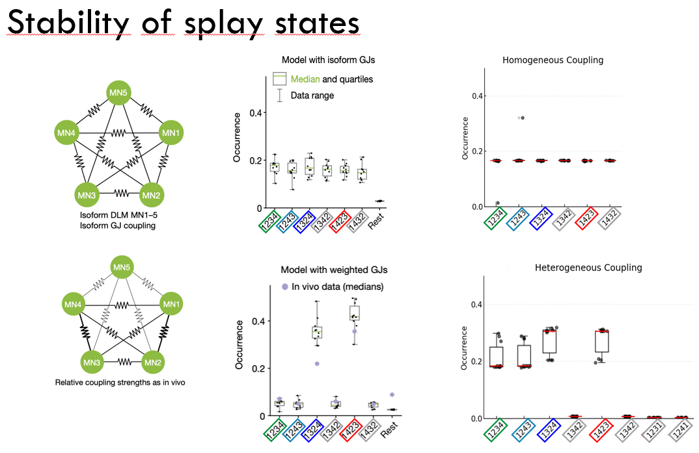
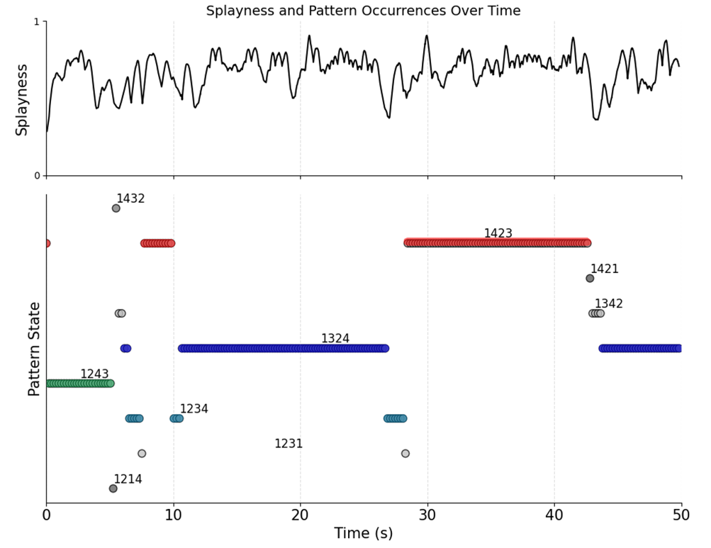

# Desynchronization - a Bug or a Feature 
Analysis inspired from the paper `Gap junctions desynchronize a neural circuit to stabilize insect flight` by `Hurkey et al`.
We analyzed splay patterns, stability and how gap junction coupling strenght affects them.

Check out the `.pptx` for further details. 
